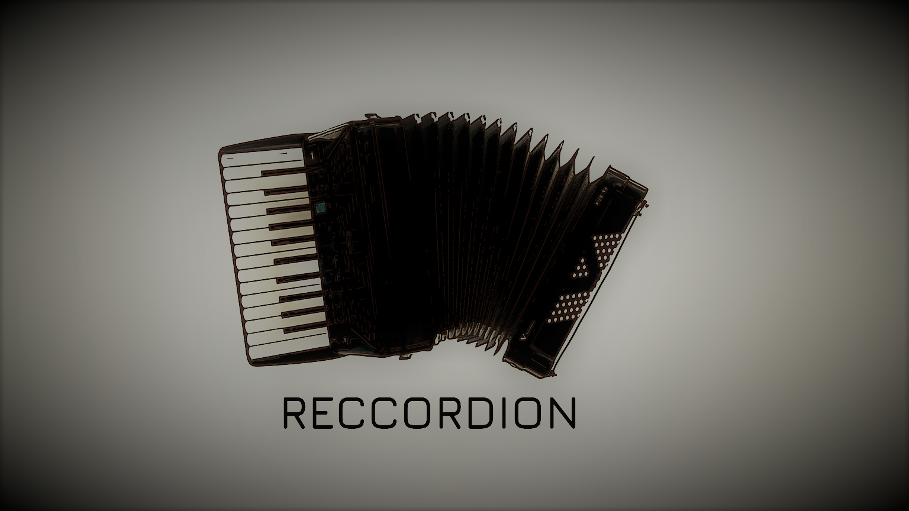

```
Will provide you a simple library interface to record your desktop.
```

# Platforms
- [x] Windows
- [ ] Linux
- [ ] MacOs

# Included examples 
- [x] C
- [x] Java
- [x] Python
- [x] Rust
- Your language of choise not there ? see one of the examples above, consider contributing to Reccordion

# Build from source
    1. Install the build Dependencies
        - cmake
        - vcpck (put the vcpckg directory in C:/vcpckg/)
    2. run `build.cmd <Debug|Release> <x86|x64>`
    3. The output dll files are going to be in `Reccordion/build/<Debug|Release>/*.dll`
    4. The examples will be found in `Reccordion/examples/<c|java|python|rust>`

# Note
- Examples are not built by default
- If you want to build the examples set `set(BUILD_EXAMPLES TRUE)` in CMakeLists.txt
- Make sure you also have Java jdk, Python3 and Rust installed and added to your environment variables 

# How to contribute ?
- Pull requests are welcome !
- Try to port Reccordion to other platforms
- Add more examples to the list of `Included examples`
- Let me know if it works for you, add yourself to the list of apps using Reccordion !

# LICENSE
```
MIT License
Copyright (c) 2020 Omar Sherif Fathy

Permission is hereby granted, free of charge, to any person obtaining a copy
of this software and associated documentation files (the "Software"), to deal
in the Software without restriction, including without limitation the rights
to use, copy, modify, merge, publish, distribute, sublicense, and/or sell
copies of the Software, and to permit persons to whom the Software is
furnished to do so, subject to the following conditions:

The above copyright notice and this permission notice shall be included in all
copies or substantial portions of the Software.

THE SOFTWARE IS PROVIDED "AS IS", WITHOUT WARRANTY OF ANY KIND, EXPRESS OR
IMPLIED, INCLUDING BUT NOT LIMITED TO THE WARRANTIES OF MERCHANTABILITY,
FITNESS FOR A PARTICULAR PURPOSE AND NONINFRINGEMENT. IN NO EVENT SHALL THE
AUTHORS OR COPYRIGHT HOLDERS BE LIABLE FOR ANY CLAIM, DAMAGES OR OTHER
LIABILITY, WHETHER IN AN ACTION OF CONTRACT, TORT OR OTHERWISE, ARISING FROM,
OUT OF OR IN CONNECTION WITH THE SOFTWARE OR THE USE OR OTHER DEALINGS IN THE
SOFTWARE.
```
